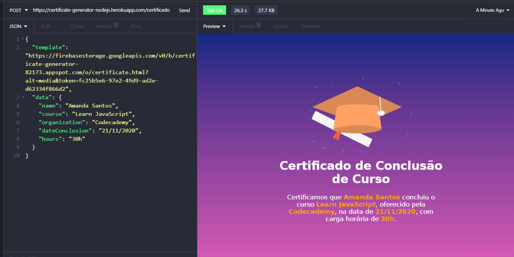

<h1 align="center">
  
  <br />Certificate Generator
</h1>

<p align="center">
  

  <a href="https://www.linkedin.com/in/amandasf/">
    
  </a>
  
  
  
  <a href="https://github.com/amanda-santos/certificate-generator/commits/master">
    
  </a>
  
  <a href="https://github.com/amanda-santos/certificate-generator/issues">
    
  </a>
  
  
</p>

<p align="center">
  <a href="#-about-the-project">About the project</a>&nbsp;&nbsp;&nbsp;|&nbsp;&nbsp;&nbsp;
  <a href="#-technologies">Technologies</a>&nbsp;&nbsp;&nbsp;|&nbsp;&nbsp;&nbsp;
  <a href="#-getting-started">Getting started</a>&nbsp;&nbsp;&nbsp;|&nbsp;&nbsp;&nbsp;
  <a href="#-how-to-contribute">How to contribute</a>&nbsp;&nbsp;&nbsp;|&nbsp;&nbsp;&nbsp;
  <a href="#-license">License</a>
</p>

## 👩🏻‍💻 About the project

<p style="color: red;">This API generates a course conclusion certificate based on an sent HTML Handlebars Template and the certificate data, including the name of the student, the name of the course concluded, the organization which offered the course, the number of hours and the date of conclusion.</p>

Published here: https://certificate-generator-nodejs.herokuapp.com/certificado

## 🚀 Technologies

Technologies that I used to develop this API:

- [Node.js](https://nodejs.org/en/)
- [Express](https://expressjs.com/pt-br/)
- [Handlebars](https://handlebarsjs.com/)
- [Puppeteer](https://pptr.dev/)
- HTML5
- CSS3

## ⌨ Getting started

Using [Insomnia](https://insomnia.rest/download/) or [Postman](https://www.postman.com/), insert the following URL: https://certificate-generator-nodejs.herokuapp.com/certificado in an POST requisition.
Next, insert the following parameters in the body of the requisition:
```
{
	"template": "https://firebasestorage.googleapis.com/v0/b/certificate-generator-82173.appspot.com/o/certificate.html?alt=media&token=fc25b5e6-97e2-49d9-ad2e-d62334f866d2",
	"data": {
		"name": "<Student Name>",
		"course": "<Course Name>",
		"organization": "<Organization Name>",
		"dateConclusion": "<Date of Conclusion>",
		"hours": "<Hours spent in the course>"
	}
}
```

## 🖥 Preview



## 🤔 How to contribute

**Make a fork of this repository**

```bash
# Fork using GitHub official command line
# If you don't have the GitHub CLI, use the web site to do that.

$ gh repo fork amanda-santos/certificate-generator
```

**Follow the steps below**

```bash
# Clone your fork
$ git clone your-fork-url && cd certificate-generator

# Create a branch with your feature
$ git checkout -b my-feature

# Make the commit with your changes
$ git commit -m 'feat: My new feature'

# Send the code to your remote branch
$ git push origin my-feature
```

After your pull request is merged, you can delete your branch

## 📝 License

This project is licensed under the MIT License - see the [LICENSE](LICENSE) file for details.

---

Made with 💜 by Amanda Santos <br />
👋 [See my LinkedIn](https://www.linkedin.com/in/amandasf/)
